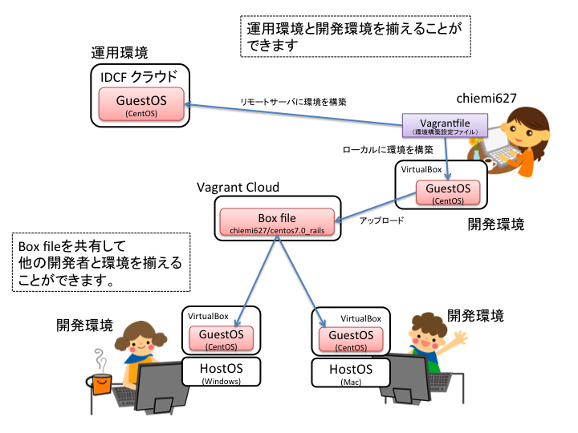

enPiT筑波大Webアプリ開発環境セット
====

概要
---
Webアプリ（Ruby on Rails）の開発環境構築セットです。
開発メンバーの開発環境(OS等）が異なっている場合でも、仮想マシンを
使って簡単に同じ環境を用意することができます。

また、同じ環境をクラウド上に構築することもできます。
（なお、協力企業のIDCフロンティアのクラウドサービスを利用することを想定しています）

開発環境の構成
---
* OS: Cent OS 7.0

**** Railsセット
* インストールされているもの
  * Ruby(2.2), Java(1.8), gcc(4.8.3)
  * Ruby on Rails(4.2.3)
  * Postgresql(9.2), MySQL(5.5), SQLite(3.7)
  * GitHubと連携するための各種コマンド(git, hub, github-connect.sh)
  * 各種設定ファイル（.bash_profile, .gemrc, .gitconfig)

**** CakePHPセット
* インストールされているもの
  * PHP(5.6),Ruby(2.2), Java(1.8), gcc(4.8.3)
  * CakePHP3を使うのに必要なもの（icu, mbstring, pdo(mysql))
  * Postgresql(9.2), MySQL(5.5), SQLite(3.7)
  * GitHubと連携するための各種コマンド(git, hub, github-connect.sh)
  * 各種設定ファイル（.bash_profile, .gemrc, .gitconfig)

構築手順
---
* [準備](preparation.md)
* [開発環境(仮想マシン)を構築する](generateVM.md)
* [開発環境の構成を変更する](modifyVagrantfile.md)
* [クラウド上に環境を設定する(Railsセットのみ)](deployVM.md)

関連するリポジトリ
---
* [github:chiemi627/vagrant_cookbook_centos70](https://github.com/chiemi627/vagrant_cookbook_centos70)
* [github:ychubachi/entit](https://github.com/ychubachi/enpit)
  * Railsのハンズオン資料です。かなり丁寧なのでおすすめです。
* [github:ychubachi/enpit_vagrant](https://github.com/ychubachi/enpit_vagrant)
